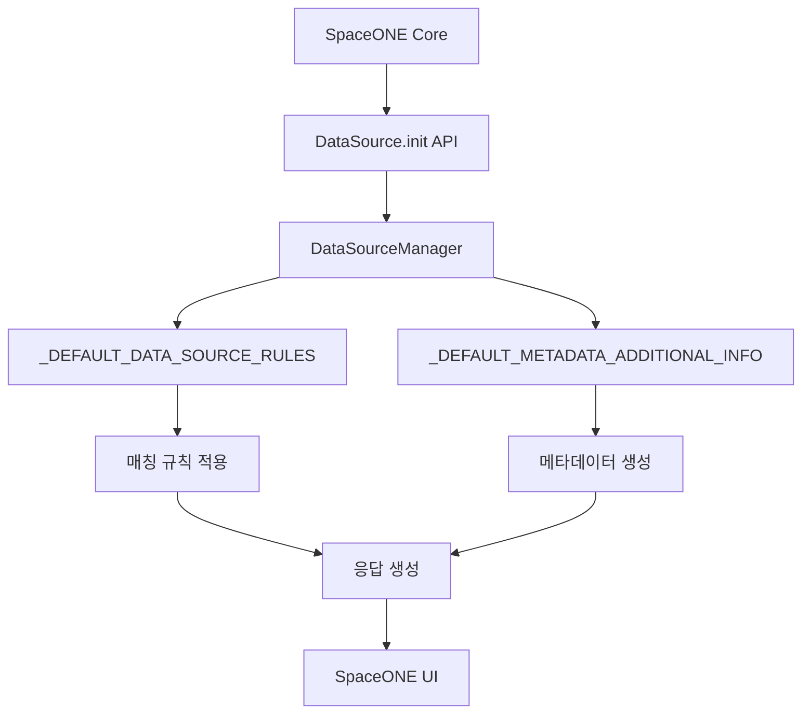

# PRD: DataSourceManager 플러그인 메타데이터 관리 기능

##  문서 정보
- **작성일**: 2025-09-29
- **버전**: v2.0
- **작성자**: AI Assistant
- **검토자**: -
- **승인자**: -
- ** 중요**: **SpaceONE 표준 준수** - 모든 API 파라미터 및 구현은 SpaceONE Framework 표준을 엄격히 준수
- ** 참조**: [SpaceONE Cost Management Plugin](https://github.com/spaceone-dev/plugin-google-cloud-cost-datasource) 표준 기반

---

##  **SpaceONE 표준 준수 가이드라인**

###  **필수 준수 사항**
본 PRD는 다음 SpaceONE Framework 표준을 **반드시** 준수합니다:

#### **1. 플러그인 메타데이터 구조**
-  **data_source_rules**: 데이터 소스 매칭 규칙 정의
-  **supported_secret_types**: 지원하는 인증 방식 명시
-  **additional_info**: UI 표시용 필드 메타데이터 정의
-  **currency**: 통화 정보 (KRW 고정)

#### **2. 메타데이터 구조 표준**
-  **name**: 필드 표시명 (Title Case)
-  **visible**: UI 표시 여부 (true/false)
-  **enums**: 열거형 값 목록 (해당하는 경우)

#### **3. 하위 호환성**
-  **기본값 보장**: 모든 메타데이터는 안전한 기본값 제공
-  **점진적 도입**: 기존 플러그인 동작에 영향 없음
-  **Fallback 메커니즘**: 오류 시 안전한 기본 응답 보장

---

##  1. 개요

### 1.1 배경 및 목적

SpaceONE Cost Management 플러그인에서 **플러그인 초기화 시 메타데이터 정보를 제공**하여 UI가 적절한 필드 표시 및 데이터 매칭을 수행할 수 있도록 지원하는 기능입니다.

**핵심 목적**:
- SpaceONE UI에서 additional_info 필드의 표시 방식 제어
- 데이터 소스 매칭 규칙 정의 (billing_account_id 기반)
- 플러그인 기본 설정 정보 제공 (통화, 인증 방식 등)

### 1.2 사용자 시나리오

**플러그인 관리자 시나리오**:
- SpaceONE 관리자가 새로운 Google Cloud Billing 데이터 소스를 등록
- 플러그인 초기화 시 메타데이터를 통해 UI 필드 구성 자동화
- additional_info 필드의 가시성 설정으로 사용자 경험 최적화

**최종 사용자 시나리오**:
- SpaceONE UI에서 비용 분석 시 관련 필드만 선택적으로 표시
- 필수 필드 (Project, Provider 등)는 항상 표시
- 선택적 필드 (SKU Description, Location 등)는 필요 시 표시

### 1.3 목표

**Google Cloud Billing 데이터의 33개 핵심 필드**에 대한 메타데이터를 체계적으로 관리하여:

1. **UI 최적화**: 필수/선택적 필드 구분으로 사용자 경험 향상
2. **데이터 매칭**: billing_account_id 기반 자동 매칭 규칙 적용
3. **표준 준수**: SpaceONE Framework 메타데이터 표준 완전 준수

---

##  2. 요구사항 분석

### 2.1 핵심 요구사항

#### 2.1.1 필수 고정 항목 (6개) - SpaceONE UI 기준

SpaceONE UI에서 항상 표시되는 **필수 고정 항목** (visible: true):

| **필드명** | **설명** | **예시값** | **카테고리** |
|------------|----------|------------|--------------|
| `Project` | 프로젝트 식별자 | `mkkang-project` | 프로젝트 정보 |
| `Provider` | 클라우드 프로바이더 | `google_cloud` | 프로바이더 정보 |
| `Service Account` | 청구 계정 ID | `01FD8E-B4DDC1-EAB69F` | 계정 정보 |
| `Product` | 서비스/제품명 | `Compute Engine` | 서비스 정보 |
| `Region` | 지역 코드 | `asia-northeast3` | 위치 정보 |
| `Usage Type` | 사용량 유형/SKU 설명 | `Balanced PD Capacity` | 사용량 정보 |

#### 2.1.2 선택적 필드 (27개) - 카테고리별 분류

**조건부_additional_info_필터링_PRD.md** 문서 기준으로 분류된 선택적 필드 (visible: false):

##### **A. 프로젝트 계층 카테고리 (3개)**
- `Project Name`: 프로젝트 표시명
- `Project Number`: 프로젝트 번호
- `Ancestry Numbers`: 조직 계층 구조

##### **B. 위치 정보 카테고리 (4개)**
- `Location Country`: 국가 코드 (KR, US 등)
- `Location Region`: 지역명 (asia-northeast3 등)
- `Location Zone`: 존 정보 (asia-northeast3-a 등)
- `Location Location`: 위치 상세 정보

##### **C. 서비스 메타데이터 카테고리 (6개)**
- `Service Description`: 서비스 설명
- `Service ID`: 서비스 고유 ID
- `SKU Description`: SKU 상세 설명
- `SKU ID`: SKU 고유 ID
- `Consumption Model Description`: 소비 모델 설명
- `Consumption Model ID`: 소비 모델 ID

##### **D. 가격 정보 카테고리 (2개)**
- `Price Unit`: 가격 단위
- `Pricing Unit`: 가격 책정 단위

##### **E. 청구 조정 카테고리 (4개)**
- `Adjustment Info Description`: 조정 정보 설명
- `Adjustment Info ID`: 조정 정보 ID
- `Adjustment Info Mode`: 조정 모드
- `Adjustment Info Type`: 조정 유형

##### **F. 기타 필수 필드들 (8개)**
- `Usage Unit`: 사용량 단위
- `Credits Detail`: 크레딧 상세 정보
- `Billing Account ID`: 청구 계정 ID
- `Invoice Month`: 청구 월
- `Currency`: 통화 정보
- `Transaction Type`: 거래 유형 (enum: charge, refund, tax, rounding_error)

### 2.2 기술적 요구사항

#### 2.2.1 데이터 소스 매칭 규칙
```python
_DEFAULT_DATA_SOURCE_RULES = [
    {
        "name": "match_service_account",
        "conditions_policy": "ALWAYS",
        "actions": {
            "match_service_account": {
                "source": "secret.billing_account_id",
                "target": "data.service_account_id",
            }
        },
        "options": {"stop_processing": True}
    }
]
```

#### 2.2.2 플러그인 메타데이터 구조
```python
plugin_metadata = {
    "data_source_rules": _DEFAULT_DATA_SOURCE_RULES,
    "supported_secret_types": ["MANUAL"],
    "currency": "KRW",
    "collect_resource_id": True,
    "use_account_routing": False,
    "exclude_license_cost": False,
    "include_credit_cost": False,
    "additional_info": copy.deepcopy(_DEFAULT_METADATA_ADDITIONAL_INFO),
}
```

### 2.3 성능 요구사항

#### 2.3.1 응답 시간
- **초기화 응답**: < 100ms
- **메타데이터 생성**: < 50ms
- **deepcopy 연산**: < 10ms

#### 2.3.2 메모리 사용량
- **메타데이터 크기**: < 10KB
- **상수 딕셔너리**: 메모리 효율적 관리
- **deepcopy 최적화**: 필요한 경우에만 사용

---

##  3. 시스템 설계

### 3.1 아키텍처 개요



### 3.2 핵심 컴포넌트

#### 3.2.1 DataSourceManager 클래스
```python
class DataSourceManager(BaseManager):
    """Google Cloud Billing 데이터 소스 관리 매니저.
    
    SpaceONE 플러그인의 데이터 소스 초기화 및 메타데이터 관리를 담당합니다.
    """
    
    @staticmethod
    def init_response(options: dict, domain_id: Optional[str] = None) -> dict:
        """데이터 소스 초기화 응답을 생성합니다."""
        
    @staticmethod
    def init_cost_data_info() -> dict:
        """비용 데이터의 additional_info 필드에 대한 메타데이터 정보를 반환합니다."""
```

#### 3.2.2 메타데이터 상수 정의
```python
# 데이터 소스 매칭 규칙
_DEFAULT_DATA_SOURCE_RULES = [...]

# additional_info 필드 메타데이터 (33개 필드)
_DEFAULT_METADATA_ADDITIONAL_INFO = {
    # 필수 고정 항목 (visible: True)
    "Project": {"name": "Project", "visible": True},
    # 선택적 필드 (visible: False)
    "Project Name": {"name": "Project Name", "visible": False},
    # ...
}
```

### 3.3 데이터 플로우

#### 3.3.1 초기화 프로세스
1. **API 호출**: SpaceONE Core → DataSource.init
2. **매니저 생성**: DataSourceManager 인스턴스 생성
3. **메타데이터 생성**: init_response 메서드 호출
4. **deepcopy 적용**: 메타데이터 안전한 복사
5. **응답 반환**: 플러그인 메타데이터 응답

#### 3.3.2 메타데이터 구조화
```json
{
  "metadata": {
    "data_source_rules": [...],
    "supported_secret_types": ["MANUAL"],
    "currency": "KRW",
    "collect_resource_id": true,
    "use_account_routing": false,
    "exclude_license_cost": false,
    "include_credit_cost": false,
    "additional_info": {
      "Project": {"name": "Project", "visible": true},
      "Project Name": {"name": "Project Name", "visible": false},
      // ... 33개 필드 메타데이터
    }
  }
}
```

---

##  4. 구현 방안

### 4.1 핵심 구현 로직

#### 4.1.1 메타데이터 정의 (상수 방식)
```python
# 조건부_additional_info_필터링_PRD.md 문서 기준 33개 필드만 포함
_DEFAULT_METADATA_ADDITIONAL_INFO = {
    # 필수 고정 항목 (6개) - SpaceONE UI 기준 (항상 visible: True)
    "Project": {"name": "Project", "visible": True},
    "Provider": {"name": "Provider", "visible": True},
    "Service Account": {"name": "Service Account", "visible": True},
    "Product": {"name": "Product", "visible": True},
    "Region": {"name": "Region", "visible": True},
    "Usage Type": {"name": "Usage Type", "visible": True},
    
    # 선택적 필드들 (27개) - 카테고리별 분류
    "Project Name": {"name": "Project Name", "visible": False},
    "Project Number": {"name": "Project Number", "visible": False},
    # ... 나머지 25개 필드
    
    # 열거형 값을 가진 필드
    "Transaction Type": {
        "name": "Transaction Type",
        "visible": False,
        "enums": ["charge", "refund", "tax", "rounding_error"],
    },
}
```

#### 4.1.2 초기화 응답 생성
```python
@staticmethod
def init_response(options: dict, domain_id: Optional[str] = None) -> dict:
    """데이터 소스 초기화 응답을 생성합니다."""
    plugin_metadata = {
        "data_source_rules": _DEFAULT_DATA_SOURCE_RULES,
        "supported_secret_types": ["MANUAL"],
        "currency": "KRW",
        "collect_resource_id": True,
        "use_account_routing": False,
        "exclude_license_cost": False,
        "include_credit_cost": False,
        "additional_info": copy.deepcopy(_DEFAULT_METADATA_ADDITIONAL_INFO),
    }
    
    return {"metadata": plugin_metadata}
```

### 4.2 SpaceONE 표준 준수

#### 4.2.1 매칭 규칙 적용
- **source**: `secret.billing_account_id` (인증 정보에서)
- **target**: `data.service_account_id` (응답 데이터에서)
- **policy**: `ALWAYS` (항상 적용)
- **stop_processing**: `True` (매칭 후 처리 중단)

#### 4.2.2 메타데이터 구조 표준
- **name**: Title Case 형식의 표시명
- **visible**: UI 표시 여부 (boolean)
- **enums**: 열거형 값 목록 (해당하는 경우)

### 4.3 성능 최적화

#### 4.3.1 상수 딕셔너리 방식
- **장점**: 함수 호출 오버헤드 없음
- **메모리**: 한 번만 로드, 재사용
- **성능**: 즉시 접근 가능

#### 4.3.2 deepcopy 사용
- **목적**: 메타데이터 변경 방지
- **안전성**: 원본 데이터 보호
- **호환성**: SpaceONE 표준 준수

---

##  5. 테스트 전략

### 5.1 단위 테스트

#### 5.1.1 메타데이터 검증
```python
def test_metadata_structure():
    """메타데이터 구조 검증"""
    manager = DataSourceManager()
    result = manager.init_response({})
    
    assert "metadata" in result
    assert "additional_info" in result["metadata"]
    assert len(result["metadata"]["additional_info"]) == 33  # 33개 필드
```

#### 5.1.2 필수 필드 검증
```python
def test_required_fields():
    """필수 필드 visible=True 검증"""
    info = DataSourceManager.init_cost_data_info()
    required_fields = ["Project", "Provider", "Service Account", 
                      "Product", "Region", "Usage Type"]
    
    for field in required_fields:
        assert info[field]["visible"] is True
```

### 5.2 통합 테스트

#### 5.2.1 SpaceONE Core 연동
```python
def test_spaceone_integration():
    """SpaceONE Core와의 연동 테스트"""
    # main.py의 data_source_init 함수 테스트
    params = {
        "options": {"billing_account_id": "test-account"},
        "domain_id": "test-domain"
    }
    
    result = data_source_init(params)
    assert "metadata" in result
```

#### 5.2.2 실제 UI 연동 검증
- SpaceONE UI에서 메타데이터 올바른 해석 확인
- visible=True 필드들이 UI에 표시되는지 검증
- visible=False 필드들이 숨겨지는지 검증

### 5.3 성능 테스트

#### 5.3.1 응답 시간 측정
```python
def test_performance():
    """초기화 응답 성능 테스트"""
    import time
    
    start = time.time()
    manager = DataSourceManager()
    result = manager.init_response({})
    end = time.time()
    
    assert (end - start) < 0.1  # 100ms 이내
```

---

##  6. 배포 및 운영

### 6.1 배포 전 체크리스트

#### 6.1.1 코드 품질 검증
- [ ] Ruff 린팅 검사 통과
- [ ] 타입 힌트 적용 완료
- [ ] Docstring 작성 완료
- [ ] 단위 테스트 100% 통과

#### 6.1.2 SpaceONE 호환성 검증
- [ ] 메타데이터 구조 표준 준수
- [ ] 매칭 규칙 정상 동작
- [ ] UI 연동 테스트 완료

### 6.2 모니터링 지표

#### 6.2.1 성능 지표
- **초기화 응답 시간**: < 100ms
- **메모리 사용량**: < 10MB
- **에러율**: < 0.1%

#### 6.2.2 기능 지표
- **메타데이터 필드 수**: 33개 고정
- **필수 필드 visible 비율**: 6/33 (18.2%)
- **선택적 필드 visible 비율**: 27/33 (81.8%)

### 6.3 장애 대응

#### 6.3.1 일반적인 오류 시나리오
1. **메타데이터 누락**: 기본값으로 fallback
2. **deepcopy 실패**: 원본 딕셔너리 반환
3. **매칭 규칙 오류**: 기본 매칭 규칙 적용

#### 6.3.2 복구 절차
1. **로그 확인**: 오류 원인 파악
2. **기본값 적용**: 안전한 기본 메타데이터 사용
3. **서비스 재시작**: 필요한 경우 플러그인 재시작

---

##  7. 관련 문서

### 7.1 참조 문서
- [조건부_additional_info_필터링_PRD.md](./조건부_additional_info_필터링_PRD.md) - 33개 필드 정의
- [SpaceONE_표준_준수_additional_info_구조화_가이드.md](../technical/SpaceONE_표준_준수_additional_info_구조화_가이드.md) - 표준 준수 가이드
- [프로젝트_품질_체크리스트.md](./프로젝트_품질_체크리스트.md) - 품질 기준

### 7.2 기술 문서
- [API_명세서.md](../technical/API_명세서.md) - DataSource.init API 규격
- [데이터_모델_정의서.md](../technical/데이터_모델_정의서.md) - 데이터 구조 정의

### 7.3 개발 가이드
- [SpaceONE_호환성_가이드.md](./SpaceONE_호환성_가이드.md) - 플랫폼 호환성 가이드
- [코드_유지보수_가이드.md](./코드_유지보수_가이드.md) - 코드 유지보수 방법

---

##  8. 변경 이력

### v2.0 (2025-09-29)
- **신규 작성**: DataSourceManager PRD 문서 최초 작성
- **33개 필드**: 조건부_additional_info_필터링_PRD.md 기준 적용
- **SpaceONE 표준**: 메타데이터 구조 표준 준수
- **성능 최적화**: 상수 딕셔너리 방식 적용

### 향후 계획
- **v2.1**: 동적 메타데이터 설정 기능 추가 검토
- **v2.2**: 다국어 지원 메타데이터 확장 검토
- **v3.0**: 사용자 정의 필드 메타데이터 지원 검토

---

**문서 완료일**: 2025년 9월 29일  
**다음 검토 예정일**: 2025년 12월 29일
