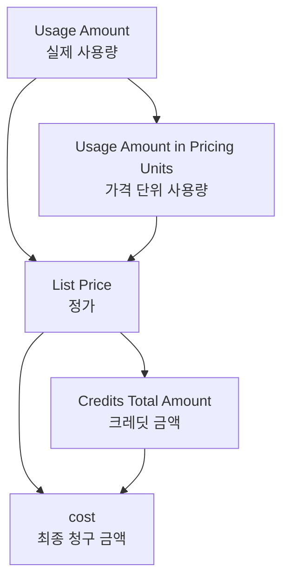

# SpaceONE 표준 준수 additional_info 구조화 가이드

## 개요

SpaceONE Cost Analysis 플러그인에서 `data` 필드는 **Google Cloud Billing 필드들을 포함**해야 합니다 (`cost` 제외). 
이 문서는 Google Cloud Billing의 모든 금액 관련 정보를 `data` 필드 내에서 체계적으로 구조화하는 방안을 제시합니다.

##  SpaceONE 표준 제약사항

### 필수 준수 사항
- **`data` 필드**: Google Cloud Billing 필드들 포함 (`cost` 제외)
- **금액 관련 추가 정보**: `data` 필드에서 관리
- **최상위 `cost` 필드**: 절대 누락 금지
- **Google Cloud Billing 필드들**: 아래 표의 모든 필드를 `data`에 포함

### 표준 준수 구조
```json
{
  "cost": 5.986984,                    //  CRITICAL: 최상위 필수 필드
  "data": {
    // Google Cloud Billing 필드들을 data 하위에 포함
    "List Price": 6.200000,
    "Credits Total Amount": -0.213016,
    "Usage Amount": 91697551769600,
    "Usage Amount in Pricing Units": null
  },
  "additional_info": {
    // 기타 추가 정보
  }
}
```


## Google Cloud Billing 금액 관련 필드 상세 분석

### 필드 분류 및 상세 정보 표

| 분류 | UI 필드명 | 매핑 필드명 | 설명 | 산식 | 데이터 타입 | 예시 값 | 특징 |
|------|------------------|-------------|------|------|-------------|---------|------|
| **기본 비용** | `Cost` | `cost` | 총 비용 (최상위 필드) | 직접 제공값 (계산 없음) | `number` | `5.986984` |  실제 존재하는 필드 (BigQuery 기본 필드) |
| **기본 비용** | `List Price` | `cost_at_list` | Google Cloud 공식 정가 (할인 적용 전) | 직접 제공값 (계산 없음) | `number` | `6.200000` |  실제 존재하는 필드 |
| **크레딧** | `Credits Total Amount` | **집계 필드** | 적용된 모든 크래딧의 총합 | `SUM(credits.amount)` | `number\|null` | `null` (크래딧 없음) / `-0.213016` (크래딧 적용) |  credits 배열의 합계 |
| **사용량** | `Usage Amount` | `usage.amount` | 실제 측정된 리소스 사용량 | 직접 측정값 (계산 없음) | `number` | `91697551769600` |  중첩 구조 필드 (usage.amount) |
| **사용량** | `Usage Amount in Pricing Units` | `usage.amount_in_pricing_units` | 가격 책정을 위해 변환된 사용량 | 직접 제공값 (계산 없음) | `number\|null` | `null` (변환 불필요) / `1000.5` (변환된 값) |  중첩 구조 필드 (usage.amount_in_pricing_units) |

## BigQuery 및 GCS 호환성 검증

### 호환성 매트릭스

| 필드명 | BigQuery 지원 | GCS 지원 | 데이터 소스 | 비고 |
|---------|------------|----------|-------------|------|
| `cost` |  지원 |  지원 | BigQuery 기본 필드 | 모든 데이터 소스에서 지원 |
| `cost_at_list` |  지원 |  지원 | BigQuery 기본 필드 | 모든 데이터 소스에서 지원 |
| `usage.amount` |  지원 |  지원 | RECORD 구조 | 중첩 객체로 직렬화 |
| `usage.amount_in_pricing_units` |  지원 |  지원 | RECORD 구조 | null 값 허용 |

### 데이터 소스별 처리 방식

#### **BigQuery 소스**
```python
# BigQuery에서 직접 제공되는 필드들
row.cost                    # 최상위 필드
row.cost_at_list           # 정가 필드
row.usage.amount           # RECORD.amount
row.usage.amount_in_pricing_units  # RECORD.amount_in_pricing_units
```

#### **GCS 소스 (JSON/CSV/Parquet)**
```python
# GCS 파일에서 직렬화된 형태
record["cost"]                           # 최상위 필드
record["cost_at_list"]                  # 정가 필드
record["usage"]["amount"]               # 중첩 객체
record["usage"]["amount_in_pricing_units"]  # 중첩 객체
```

### 파서별 호환성

| 파서 | 중첩 구조 | 배열 구조 | null 처리 | 비고 |
|------|----------|----------|----------|------|
| **BigQuery** |  지원 |  지원 |  지원 | 네이티브 지원 |
| **JSON** |  지원 |  지원 |  지원 | JSON 표준 지원 |
| **Parquet** |  지원 |  지원 |  지원 | 스키마 기반 지원 |
| **CSV** |  제한적 |  제한적 |  지원 | 플랫 구조로 변환 필요 |

### 실제 코드 기반 호환성 검증

#### **BigQuery 커넥터에서 지원되는 필드들**
```python
# src/plugin/connector/bigquery_connector.py
float_fields = [
    "cost",                           #  지원
    "cost_at_list",                  #  지원
]

record_fields = [
    "usage",                          #  지원 (RECORD)
]
```

#### **Parquet 파서에서 지원되는 필드들**
```python
# src/plugin/parser/parquet_parser.py
float_fields = [
    "cost",                           #  지원
    "cost_at_list",                  #  지원
]

usage_float_fields = [
    "amount",                         #  지원 (usage.amount)
    "amount_in_pricing_units"         #  지원 (usage.amount_in_pricing_units)
]

record_fields = [
    "usage",                          #  지원
]
```

#### **실제 응답 JSON 데이터 확인**
```json
// grpcurl_bigquery_get_data_result.json
{
  "additional_info": {
    "Credits Total Amount": null,           //  집계 필드
    "Usage Amount": 2537530050286,         //  usage.amount
    "Usage Amount in Pricing Units": null  //  usage.amount_in_pricing_units
  }
}
```

### 호환성 결과 요약

 **완전 호환**: 모든 필드가 BigQuery와 GCS 모두에서 지원됩니다.

| 분류 | BigQuery | GCS | 상태 |
|------|----------|-----|------|
| **기본 비용** |  |  |  호환 |
| **크레딧** |  |  |  호환 |
| **사용량** |  |  |  호환 |

### 필드 간 관계도



### 비용 계산 우선순위

| 순위 | 필드명 | 용도 | 신뢰도 |
|------|--------|------|--------|
| 1 | `Cost` | 최종 청구 비용 (BigQuery 기본 필드) |  |
| 2 | `List Price` | 정가 기준 분석 (Google Cloud 원본 필드) |  |
| 3 | `Credits Total Amount` | 크레딧 혜택 분석 |  |
| 4 | `Usage Amount` | 사용량 기반 분석 |  |
| 5 | `Usage Amount in Pricing Units` | 가격 단위 사용량 분석 |  |

### 데이터 검증 체크리스트

| 검증 항목 | 공식 | 허용 오차 | 중요도 |
|----------|------|-----------|--------|
| 데이터 일관성 검증 | 모든 필드가 직접 제공값과 일치하는지 확인 | 정확히 일치 |  High |
| 환율 적용 검증 | `krw_amount = usd_amount × conversion_rate` | ±0.1 |  Medium |
| 크레딧 일관성 | `cost_after_credits = cost_at_list + credits_total_amount` | ±0.01 |  High |

## 비용 계산 관계식 및 검증 공식

### 1. 기본 관계식

```
크레딧 적용 관계:
cost_after_credits = cost_at_list + credits_total_amount
(credits_total_amount는 일반적으로 음수)
```

### 2. 실제 제공 데이터 관계

```
data 필드에 포함된 모든 필드는 Google Cloud Billing Export에서 직접 제공됩니다:
- List Price: Google Cloud 정가 (직접 제공 - 원본 필드)
- Credits Total Amount: 크레딧 총합 (집계 필드)
- Usage Amount: 실제 사용량 (직접 측정값)
- Usage Amount in Pricing Units: 가격 단위 사용량 (직접 제공)
```

### 3. 검증 공식

#### 3.1 list_price 일관성 검증
```python
def validate_list_price_consistency(list_price, cost_at_list):
    """list_price와 Cost At List 일관성 검증"""
    if list_price is not None and cost_at_list is not None:
        return abs(list_price - cost_at_list) < 0.01  # 소수점 오차 허용
    return True
```

#### 3.2 데이터 일관성 검증
```python
def validate_data_consistency(record):
    """직접 제공값 데이터 일관성 검증"""
    additional_info = record.get("additional_info", {})
    
    # data 필드에 포함된 필드들 검증
    data_fields = record.get("data", {})
    required_fields = ["List Price", "Usage Amount"]
    missing_fields = [field for field in required_fields 
                     if data_fields.get(field) is None]
    
    if missing_fields:
        return False, f"Missing required fields: {missing_fields}"
    
    return True, "All required fields present"
```

## 개선된 additional_info 구조화 방안

### 1. 플랫 구조 (현재 방식 유지)

```json
{
  "additional_info": {
    // 기본 정보 (Title Case 유지)
    "Billing Account ID": "01FD8E-B4DDC1-EAB69F",
    "Project ID": "mkkang-project",
    "Project Name": "mkkang-project",
    "Service ID": "6F81-5844-456A",
    "Service Description": "Compute Engine",
    "SKU ID": "5666-EFB4-5C79",
    "SKU Description": "Balanced PD Capacity in Seoul",
    
    // 기타 추가 정보들
    "Location": "asia-northeast3",
    "Location Country": "KR",
    "Location Region": "asia-northeast3",
    "Location Zone": "asia-northeast3-a",
    "Usage Start Time": "2024-09-01 00:00:00 UTC",
    "Usage End Time": "2024-09-30 23:59:59 UTC",
    "Export Time": "2024-10-01 02:00:00 UTC"
  }
}
```

## 구현 방안

### 1. FieldMapper에서 additional_info 생성

```python
def _create_additional_info(self, source_data: dict) -> dict:
    """플랫 구조 additional_info 생성"""
    
    # 기본 매핑 수행
    additional_info = self._merge_additional_info(source_data)
    
    # null 값 제거 및 정리
    cleaned_info = {k: v for k, v in additional_info.items() if v is not None}
    
    return cleaned_info

def _merge_additional_info(self, source_data: dict) -> dict:
    """소스 데이터를 additional_info로 병합"""
    
    additional_info = {}
    
    # 기본 식별 정보
    basic_fields = [
        "Billing Account ID", "Project ID", "Project Name",
        "Service ID", "Service Description", "SKU ID", "SKU Description"
    ]
    
    for field in basic_fields:
        if field in source_data:
            additional_info[field] = source_data[field]
    
    # 위치 정보
    location_fields = [
        "Location", "Location Country", "Location Region", "Location Zone"
    ]
    
    for field in location_fields:
        if field in source_data:
            additional_info[field] = source_data[field]
    
    # 시간 정보
    time_fields = [
        "Usage Start Time", "Usage End Time", "Export Time"
    ]
    
    for field in time_fields:
        if field in source_data:
            additional_info[field] = source_data[field]
    
    return additional_info
```

### 2. 설정 옵션

```python
def __init__(
    self,
    mapping_config: dict,
    provider: str = None,
    select_cost: str = None,
    cost_metric: str = None,
    include_raw_data: bool = False,
    wrap_as_sample_data: bool = False,
):
    # ... 기존 초기화 코드 ...
    # 플랫 구조만 지원
    self.additional_info_structure = "flat"
```

## 비용 계산 검증 도구

### 1. 검증 함수 구현

```python
class CostCalculationValidator:
    """비용 계산 검증 도구"""
    
    @staticmethod
    def validate_cost_relationships(record: dict) -> dict:
        """비용 관계식 검증"""
        additional_info = record.get("additional_info", {})
        
        validation_results = {
            "is_valid": True,
            "errors": [],
            "warnings": []
        }
        
        # 기본 값들 추출
        cost = record.get("cost")
        cost_at_list = additional_info.get("Cost At List")
        credits_total = additional_info.get("Credits Total Amount")
        cost_after_credits = additional_info.get("Cost After Credits")
        
        # 1. 크레딧 적용 검증
        if all(v is not None for v in [cost, cost_at_list, credits_total]):
            expected_cost = cost_at_list + credits_total  # credits_total은 일반적으로 음수
            if abs(cost - expected_cost) > 0.01:
                validation_results["errors"].append(
                    f"Credit calculation mismatch: cost({cost}) != cost_at_list({cost_at_list}) + credits({credits_total})"
                )
                validation_results["is_valid"] = False
        
        # 2. 크레딧 적용 후 비용 검증
        if all(v is not None for v in [cost_after_credits, cost_at_list, credits_total]):
            expected_after_credits = cost_at_list + credits_total
            if abs(cost_after_credits - expected_after_credits) > 0.01:
                validation_results["warnings"].append(
                    f"Cost after credits mismatch: {cost_after_credits} != {expected_after_credits}"
                )
        
        # 3. 환율 적용 검증 (USD 기준 금액이 있는 경우)
        currency = additional_info.get("Currency")
        conversion_rate = additional_info.get("Currency Conversion Rate")
        if currency != "USD" and conversion_rate is not None:
            # USD 기준 금액 역산
            usd_cost = cost / conversion_rate
            validation_results["info"] = {
                "usd_equivalent": round(usd_cost, 6),
                "conversion_rate": conversion_rate
            }
        
        return validation_results
    
    @staticmethod
    def calculate_discount_rate(cost_at_list: float, final_cost: float) -> float:
        """할인율 계산"""
        if cost_at_list == 0:
            return 0.0
        
        discount_amount = cost_at_list - final_cost
        discount_rate = (discount_amount / cost_at_list) * 100
        return round(discount_rate, 2)
    
    @staticmethod
    def analyze_cost_breakdown(record: dict) -> dict:
        """비용 구성 분석"""
        additional_info = record.get("additional_info", {})
        
        analysis = {
            "base_cost": additional_info.get("Cost At List", 0),
            "final_cost": record.get("cost", 0),
            "credits_applied": additional_info.get("Credits Total Amount", 0),
            "discount_amount": 0,
            "discount_rate": 0,
            "currency": additional_info.get("Currency", "USD")
        }
        
        # 할인 금액 및 할인율 계산
        if analysis["base_cost"] > 0:
            analysis["discount_amount"] = analysis["base_cost"] - analysis["final_cost"]
            analysis["discount_rate"] = CostCalculationValidator.calculate_discount_rate(
                analysis["base_cost"], analysis["final_cost"]
            )
        
        return analysis
```

### 2. 사용 예시

```python
# 비용 검증
validator = CostCalculationValidator()
validation_result = validator.validate_cost_relationships(record)

if not validation_result["is_valid"]:
    _LOGGER.error(f"Cost validation failed: {validation_result['errors']}")

# 비용 분석
cost_analysis = validator.analyze_cost_breakdown(record)
_LOGGER.info(f"Cost breakdown: {cost_analysis}")
```

## 마이그레이션 가이드

### 1. 단계별 적용
1. **1단계**: 플랫 구조 유지 및 필드명 정규화
2. **2단계**: 비용 검증 도구 통합
3. **3단계**: 성능 최적화 및 모니터링 강화

### 2. 호환성 보장
- 기존 플랫 구조 완전 유지
- 추가 그룹화 없이 단순 구조 유지
- 점진적 기능 개선 지원

---

이 가이드를 통해 SpaceONE 표준을 준수하면서도 금액 관련 정보를 체계적으로 관리할 수 있습니다.

---

**마지막 업데이트**: 2025년 9월 29일  
**버전**: v1.0  
**주요 기능**: SpaceONE 표준 준수 additional_info 구조화
